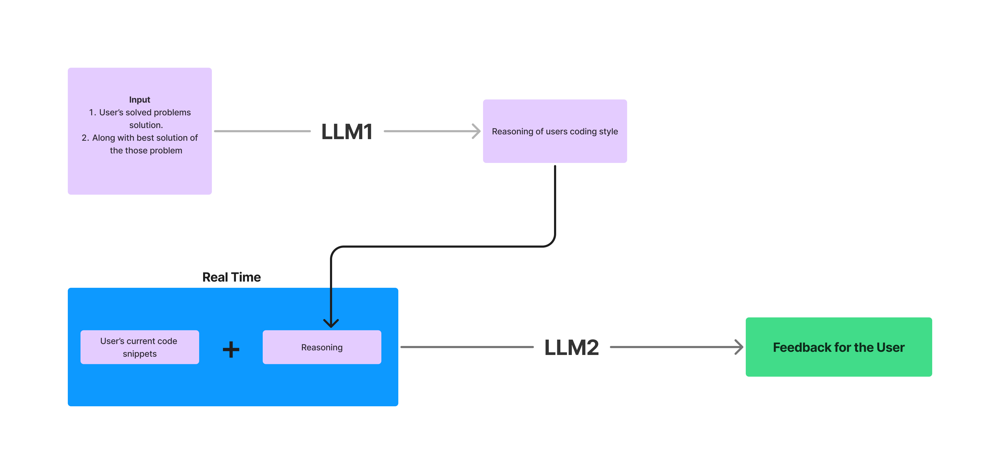

# FeedCode  

> [!TIP]
> Visit the website and get Feedback of your codes! [FeedCode](https://feedcode.onrender.com/login_page)

FeedCode is an intelligent feedback tool that provides personalized code reviews based on your coding style and activity. It leverages machine learning to analyze your frequently solved coding problems and generates insightful, context-aware feedback to help you improve your code quality and optimization skills. 

> FeedCode works on questions from [CSES Problem Set](https://cses.fi/problemset/) 

This project is developed under the [**Data Science Group (DSG)**](https://github.com/dsgiitr) and is implemented as a Flask application with templates built using HTML, CSS, and JavaScript. The backend uses a MongoDB database hosted on the cloud, ensuring smooth and efficient data management.  


---

## Key Features  

- **Personalized Feedback**: FeedCode adapts to your unique coding style by analyzing your frequently solved coding problems.  
- **Intelligent Analysis**: Generates reasoning for your coding style by scraping and processing your solved solutions.  
- **LLM-Powered Feedback**: Uses a second language model (LLM2) to analyze current code snippets and provide actionable feedback.  
- **Cloud-Based Database**: Utilizes MongoDB hosted on the cloud for seamless data storage and retrieval.  
- **Interactive Web Interface**: Frontend built with HTML, CSS, and JavaScript for an intuitive and user-friendly experience.  

---

## How It Works  

1. **Coding Style Analysis**: Scrape the solutions of frequently solved questions to generate a personalized coding style reasoning.  
2. **Comparison with Master Solutions**: Compare the user's current code snippet with master solutions of the same questions.  
3. **Feedback Generation**: Pass the reasoning and code snippets to the second language model (LLM2) to generate insightful feedback.  

> [!Note]
> Here we have choose CSES platform to scrape user's solution because of the simple nature of the website*
>  User must have atleast 5 questions solved in his/her CSES account to be able to use [feedCode](https://feedcode.onrender.com/signup_page).
---

## Tech Stack  

- **Backend**: Flask (Python)  
- **Frontend**: HTML, CSS, JavaScript  
- **Database**: MongoDB (Cloud Hosted)  
- **LLMs**: Integrating AI for feedback generation  
- **Hosting**: Local development supported, database hosted in the cloud  

---

## Installation  

### Prerequisites  

- Python 3.8+  
- MongoDB credentials for cloud database  
- `pip` for managing Python dependencies  

### Steps to Run Locally  

1. Clone the repository:  

   ```bash  
   git clone https://github.com/your-username/feedcode.git  
   cd feedcode  
2. Create a virtual environment:
   ```python 
   python3 -m venv venv  
   source venv/bin/activate  # For Linux/Mac  
   venv\Scripts\activate     # For Windows
3. Install the required dependencies:
   ```python
   pip install -r requirements.txt
4. Set up the .env file:

   Create a .env file in the root directory with the following keys:
   ```python
   - JWT_SECRET_KEY=<ANY>
   - MONGO_USER=<MONGO_USERNAME>
   - MONGO_PASSWORD=<MONGO_PASSWORD>
   - CLIENT_URL=http://localhost:3000
   - GEMINI_API_KEY=<YOUR_API_KEY>
   - PORT=5000
6. Run the Flask server:
   ```python
   python app.py
  
